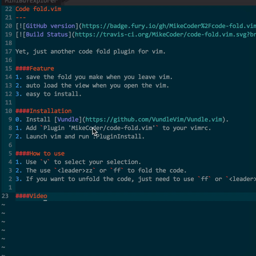

code-fold.vim
---

Yet, just another code fold plugin for vim.

####Feature
1. Save the fold you make when you leave vim.
2. Auto load the view when you open the vim.
3. Easy to install.

####Installation
0. Install [Vundle](https://github.com/VundleVim/Vundle.vim).
1. Add `Plugin 'MikeCoder/code-fold.vim'` to your vimrc.
2. Launch vim and run :PluginInstall.

####How to use
1. Use `v` to select your selection.
2. The use `<leader>zz` or `ff` to fold the code.
3. If you want to unfold the code, just need to use `ff` or `<leader>zz` again.

####Key Bindings
Using <leader>+zz and ff as default keybindings. If you want to change it to your custom keybindings.

Just add `map {Your keybindings} @=((foldclosed(line('.')) < 0) ? 'zf' : 'zd')<CR>` to your vimrc file.

####Video

####License
See [License](./LICENSE)

####TODO
See [Todo](./TODO.md)
